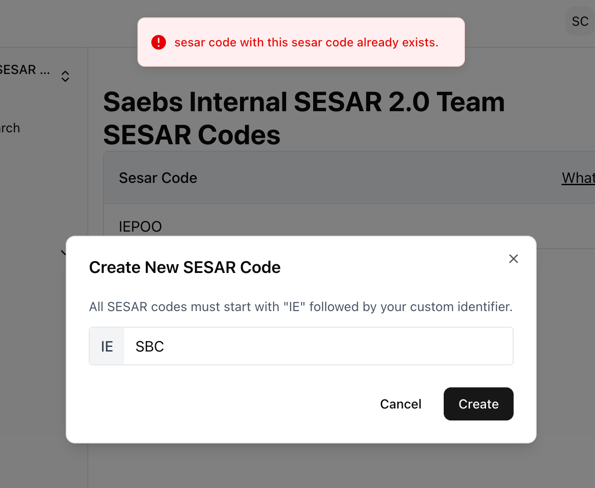

# Choose a SESAR Code

## Selecting a SESAR Code (IGSN namespace)

SESAR Codes are a tool that uniquely identifies the person or institution that registers the sample, and can be used by researchers to aid in the management of their samples. MySESAR supports multiple SESAR Codes for each user and team. SESAR Codes begin with 'IE' and are followed by 3 letters and/or numbers of your choosing (IEXXX). Common SESAR Codes are initials or abbreviations of a large project.

When you create a SESAR Code, it is important to keep in mind what samples will be registered with that SESAR Code. For example, unique SESAR Codes can be used to represent:

* Personal vs Team samples
* Different projects or grants
* Different field sessions

SESAR Codes belong to the user account or the team that created the code. Permissions can be granted to team members to share sample management (see section below). &#x20;

## **Creating a SESAR Code:**

1. To create a SESAR Code, navigate to the left hand panel and click 'SESAR Codes'.
2. Click 'Create New Code' on the upper right hand menu.
3. Under the 'Create New SESAR Code' popup, add three alphanumeric digits and click 'Create'.

If the code is already in use, the system will not allow you to create the code and flag it. Please try again until your code is successfully added. Your personal or team code will be displayed in 'SESAR Code' of your personal or team account.&#x20;

